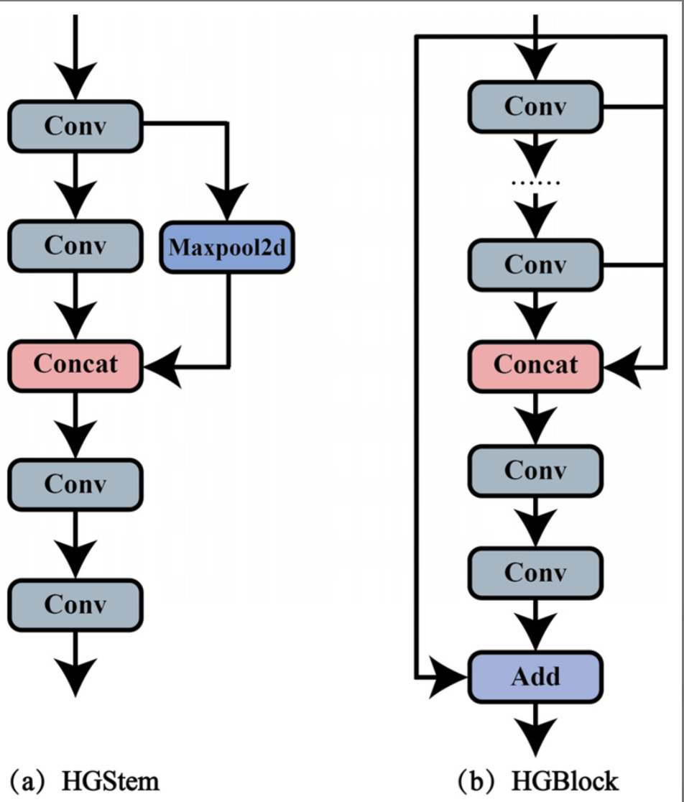
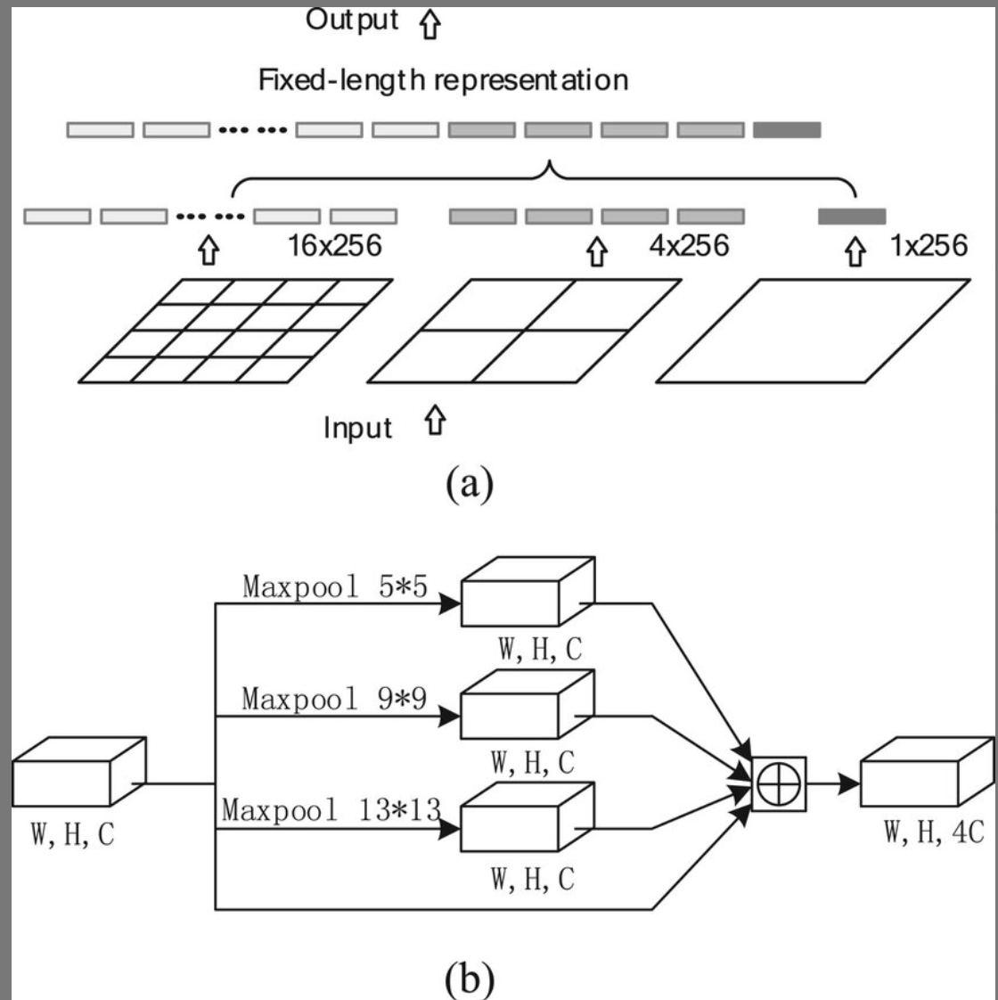
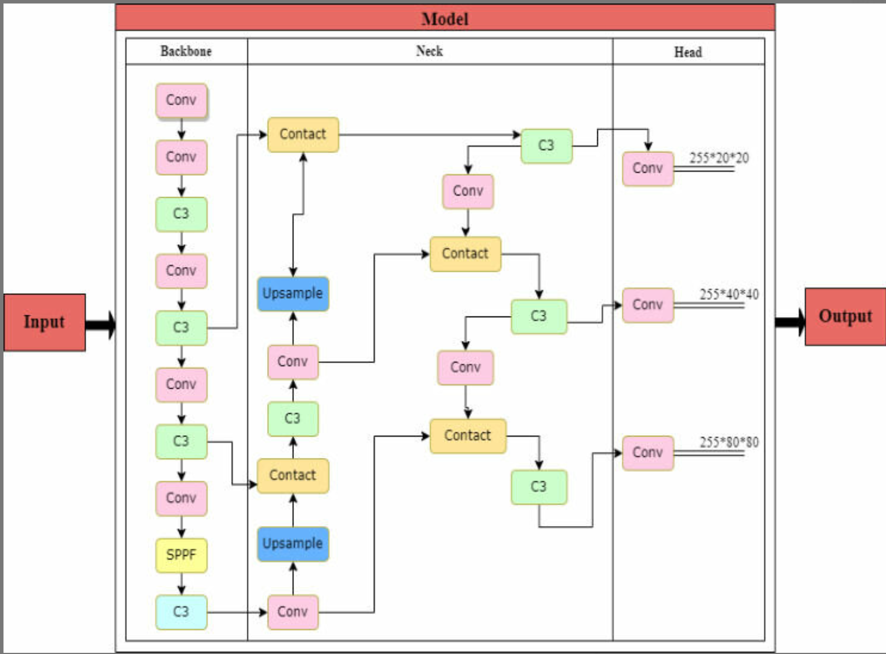

## DFL (Distribution Focal Loss)(类)

### 类代码

```python
class DFL(nn.Module):
    """
    Integral module of Distribution Focal Loss (DFL).

    Proposed in Generalized Focal Loss https://ieeexplore.ieee.org/document/9792391
    """

    def __init__(self, c1=16):
        """Initialize a convolutional layer with a given number of input channels."""
        super().__init__()
        self.conv = nn.Conv2d(c1, 1, 1, bias=False).requires_grad_(False)
        x = torch.arange(c1, dtype=torch.float)
        self.conv.weight.data[:] = nn.Parameter(x.view(1, c1, 1, 1))
        self.c1 = c1

    def forward(self, x):
        """Applies a transformer layer on input tensor 'x' and returns a tensor."""
        b, _, a = x.shape  # batch, channels, anchors
        return self.conv(x.view(b, 4, self.c1, a).transpose(2, 1).softmax(1)).view(b, 4, a)
```

### 参数介绍

#### `c1` (通道数)

- **类型**: `int`, 默认 `16`
- **作用**: 输入通道数，用于定义分布焦距损失的积分模块

### 成员属性

#### `self.conv`

- **类型**: `nn.Conv2d`
- **作用**: 1x1 卷积层，权重被初始化为固定的分布值，不参与梯度更新

#### `self.c1`

- **类型**: `int`
- **作用**: 保存输入通道数

### 成员方法

#### `forward(self, x)`

- **作用**: 前向传播，将输入通过分布焦距损失积分模块处理
- **参数**: `x` - 输入张量，形状为 `(batch, channels, anchors)`
- **返回**: 处理后的张量，形状为 `(batch, 4, anchors)`

### 原理

**分布焦距损失(DFL)的核心思想是将离散的边界框回归问题转化为连续的分布学习问题。**

传统边界框回归直接预测 4 个坐标值，而 DFL 将每个坐标预测为一个离散的概率分布：

1. **分布表示**：将连续坐标空间离散化为多个区间，每个区间对应一个概率值
2. **积分求值**：通过对概率分布进行积分来获得最终的坐标预测值
3. **损失计算**：使用分布焦距损失函数来优化预测分布与真实分布之间的差异

数学表达式：

- 预测分布：$P(x) = \text{softmax}(z)$，其中$z$是网络输出的 logits
- 积分求值：$\hat{x} = \sum_{i=1}^{n} P_i \cdot x_i$，其中$x_i$是第$i$个区间的中心坐标
- 分布焦距损失：$L_{DFL} = -(1-P_t)^\gamma \log(P_t)$，其中$P_t$是目标区间的预测概率

### 作用

**实现分布焦距损失(DFL)的积分模块，用于改进目标检测中的边界框回归。**

DFL 模块通过将离散的边界框回归问题转化为连续的分布学习问题，能够更好地处理边界框的不确定性，提高检测精度。该模块在 YOLO 系列中用于替代传统的边界框回归方法。

## Proto (YOLOv8 mask Proto module for segmentation models)(类)

### 类代码

```python
class Proto(nn.Module):
    """YOLOv8 mask Proto module for segmentation models."""

    def __init__(self, c1, c_=256, c2=32):
        """
        Initializes the YOLOv8 mask Proto module with specified number of protos and masks.

        Input arguments are ch_in, number of protos, number of masks.
        """
        super().__init__()
        self.cv1 = Conv(c1, c_, k=3)
        self.upsample = nn.ConvTranspose2d(c_, c_, 2, 2, 0, bias=True)  # nn.Upsample(scale_factor=2, mode='nearest')
        self.cv2 = Conv(c_, c_, k=3)
        self.cv3 = Conv(c_, c2)

    def forward(self, x):
        """Performs a forward pass through layers using an upsampled input image."""
        return self.cv3(self.cv2(self.upsample(self.cv1(x))))
```

### 参数介绍

#### `c1` (输入通道数)

- **类型**: `int`
- **作用**: 输入特征图的通道数

#### `c_` (中间通道数)

- **类型**: `int`, 默认 `256`
- **作用**: 中间特征图的通道数，用于控制模块的表达能力

#### `c2` (输出通道数)

- **类型**: `int`, 默认 `32`
- **作用**: 输出原型掩码的通道数，对应分割掩码的维度

### 成员属性

#### `self.cv1`

- **类型**: `Conv`
- **作用**: 3×3 卷积层，用于初步特征提取和通道数调整

#### `self.upsample`

- **类型**: `nn.ConvTranspose2d`
- **作用**: 转置卷积层，用于上采样特征图，扩大空间分辨率

#### `self.cv2`

- **类型**: `Conv`
- **作用**: 3×3 卷积层，用于进一步特征提取

#### `self.cv3`

- **类型**: `Conv`
- **作用**: 1×1 卷积层，用于生成最终的原型掩码

### 成员方法

#### `forward(self, x)`

- **作用**: 前向传播，生成用于实例分割的原型掩码
- **参数**: `x` - 输入特征图
- **返回**: 原型掩码张量，用于后续的掩码系数融合

### 原理

**Proto 模块的核心思想是学习一组原型掩码，通过与掩码系数相乘来生成最终的实例分割掩码。**

Proto 模块的工作原理：

1. **特征提取**：通过 3×3 卷积提取输入特征的高层语义信息
2. **上采样**：使用转置卷积将特征图上采样到更高的空间分辨率
3. **特征精炼**：再次通过 3×3 卷积精炼上采样后的特征
4. **原型生成**：通过 1×1 卷积生成固定数量的原型掩码

数学表达：

- 特征提取：$f_1 = \text{Conv}_{3×3}(x)$
- 上采样：$f_2 = \text{ConvTranspose}(f_1, \text{stride}=2)$
- 特征精炼：$f_3 = \text{Conv}_{3×3}(f_2)$
- 原型生成：$P = \text{Conv}_{1×1}(f_3)$，其中$P \in \mathbb{R}^{H×W×C_2}$

在 YOLO 实例分割中的应用：

- 生成$H×W×32$的原型掩码张量
- 与检测头预测的 32 维掩码系数相乘
- 通过线性组合得到最终的实例掩码

### 作用

**实现 YOLOv8 实例分割中的原型掩码生成，为每个图像生成一组共享的原型掩码。**

Proto 模块通过生成一组通用的原型掩码，使得网络能够通过学习掩码系数来组合这些原型，从而生成不同实例的个性化分割掩码。这种方法相比直接预测每个实例的完整掩码更加高效，同时能够保持较高的分割精度。该模块是 YOLO 实例分割架构中的关键组件，有效平衡了计算效率和分割性能。

## HGStem (PPHGNetV2 StemBlock)(类)

### 类代码

```python
class HGStem(nn.Module):
    """
    StemBlock of PPHGNetV2 with 5 convolutions and one maxpool2d.

    https://github.com/PaddlePaddle/PaddleDetection/blob/develop/ppdet/modeling/backbones/hgnet_v2.py
    """

    def __init__(self, c1, cm, c2):
        """Initialize the SPP layer with input/output channels and specified kernel sizes for max pooling."""
        super().__init__()
        self.stem1 = Conv(c1, cm, 3, 2, act=nn.ReLU())
        self.stem2a = Conv(cm, cm // 2, 2, 1, 0, act=nn.ReLU())
        self.stem2b = Conv(cm // 2, cm, 2, 1, 0, act=nn.ReLU())
        self.stem3 = Conv(cm * 2, cm, 3, 2, act=nn.ReLU())
        self.stem4 = Conv(cm, c2, 1, 1, act=nn.ReLU())
        self.pool = nn.MaxPool2d(kernel_size=2, stride=1, padding=0, ceil_mode=True)

    def forward(self, x):
        """Forward pass of a PPHGNetV2 backbone layer."""
        x = self.stem1(x)
        x = F.pad(x, [0, 1, 0, 1])
        x2 = self.stem2a(x)
        x2 = F.pad(x2, [0, 1, 0, 1])
        x2 = self.stem2b(x2)
        x1 = self.pool(x)
        x = torch.cat([x1, x2], dim=1)
        x = self.stem3(x)
        x = self.stem4(x)
        return x
```

### 参数介绍

#### `c1` (输入通道数)

- **类型**: `int`
- **作用**: 输入特征图的通道数

#### `cm` (中间通道数)

- **类型**: `int`
- **作用**: 中间特征图的通道数，控制模块的表达能力

#### `c2` (输出通道数)

- **类型**: `int`
- **作用**: 输出特征图的通道数

### 成员属性

#### `self.stem1`

- **类型**: `Conv`
- **作用**: 3×3 卷积层，步长为 2，用于下采样和初步特征提取

#### `self.stem2a`

- **类型**: `Conv`
- **作用**: 2×2 卷积层，用于分支特征提取

#### `self.stem2b`

- **类型**: `Conv`
- **作用**: 2×2 卷积层，用于进一步特征处理

#### `self.stem3`

- **类型**: `Conv`
- **作用**: 3×3 卷积层，步长为 2，用于融合特征和下采样

#### `self.stem4`

- **类型**: `Conv`
- **作用**: 1×1 卷积层，用于通道数调整和最终特征提取

#### `self.pool`

- **类型**: `nn.MaxPool2d`
- **作用**: 最大池化层，用于提取另一分支的特征

### 成员方法

#### `forward(self, x)`

- **作用**: 前向传播，实现 PPHGNetV2 的 stem 块功能
- **参数**: `x` - 输入特征图
- **返回**: 处理后的特征图

### 原理

**HGStem 模块的核心思想是通过多分支结构和逐步下采样，构建强大的特征提取 stem 块。**

HGStem 模块的工作原理：

1. **初始下采样**：通过 3×3 卷积进行初步特征提取和下采样
2. **双分支处理**：
   - 分支 1：最大池化提取特征
   - 分支 2：通过 2×2 卷积序列处理特征
3. **特征融合**：将两个分支的特征进行拼接
4. **最终处理**：通过 3×3 卷积进一步下采样和 1×1 卷积调整通道

数学表达：

- 初始处理：$f_1 = \text{Conv}_{3×3, stride=2}(x)$
- 分支处理：$f_{2a} = \text{Conv}_{2×2}(f_1)$, $f_{2b} = \text{Conv}_{2×2}(f_{2a})$
- 池化分支：$f_{pool} = \text{MaxPool}(f_1)$
- 特征融合：$f_{cat} = \text{Concat}(f_{pool}, f_{2b})$
- 最终输出：$f_{out} = \text{Conv}_{1×1}(\text{Conv}_{3×3, stride=2}(f_{cat}))$

### 作用

**实现 PPHGNetV2 网络的 stem 块，提供强大的初始特征提取和下采样能力。**

HGStem 模块通过多分支结构和渐进式下采样，能够有效地提取输入图像的底层特征，为后续的网络层提供高质量的特征表示。该模块在 PPHGNetV2 架构中作为网络的入口，承担着重要的特征预处理角色。

## HGBlock (PPHGNetV2 HG_Block)(类)

### 类代码

```python
class HGBlock(nn.Module):
    """
    HG_Block of PPHGNetV2 with 2 convolutions and LightConv.

    https://github.com/PaddlePaddle/PaddleDetection/blob/develop/ppdet/modeling/backbones/hgnet_v2.py
    """

    def __init__(self, c1, cm, c2, k=3, n=6, lightconv=False, shortcut=False, act=nn.ReLU()):
        """Initializes a CSP Bottleneck with 1 convolution using specified input and output channels."""
        super().__init__()
        block = LightConv if lightconv else Conv
        self.m = nn.ModuleList(block(c1 if i == 0 else cm, cm, k=k, act=act) for i in range(n))
        self.sc = Conv(c1 + n * cm, c2 // 2, 1, 1, act=act)  # squeeze conv
        self.ec = Conv(c2 // 2, c2, 1, 1, act=act)  # excitation conv
        self.add = shortcut and c1 == c2

    def forward(self, x):
        """Forward pass of a PPHGNetV2 backbone layer."""
        y = [x]
        y.extend(m(y[-1]) for m in self.m)
        y = self.ec(self.sc(torch.cat(y, 1)))
        return y + x if self.add else y
```

### 参数介绍

#### `c1` (输入通道数)

- **类型**: `int`
- **作用**: 输入特征图的通道数

#### `cm` (中间通道数)

- **类型**: `int`
- **作用**: 中间特征图的通道数，控制模块的表达能力

#### `c2` (输出通道数)

- **类型**: `int`
- **作用**: 输出特征图的通道数

#### `k` (卷积核大小)

- **类型**: `int`, 默认 `3`
- **作用**: 卷积层的核大小

#### `n` (重复次数)

- **类型**: `int`, 默认 `6`
- **作用**: 串行卷积块的重复次数

#### `lightconv` (轻量卷积)

- **类型**: `bool`, 默认 `False`
- **作用**: 是否使用轻量卷积块

#### `shortcut` (残差连接)

- **类型**: `bool`, 默认 `False`
- **作用**: 是否使用残差连接

#### `act` (激活函数)

- **类型**: `nn.Module`, 默认 `nn.ReLU()`
- **作用**: 使用的激活函数类型

### 成员属性

#### `self.m`

- **类型**: `nn.ModuleList`
- **作用**: 串行卷积块列表，用于特征提取

#### `self.sc`

- **类型**: `Conv`
- **作用**: 1×1 压缩卷积，用于通道数减少

#### `self.ec`

- **类型**: `Conv`
- **作用**: 1×1 激励卷积，用于通道数恢复

#### `self.add`

- **类型**: `bool`
- **作用**: 是否使用残差连接的标志

### 成员方法

#### `forward(self, x)`

- **作用**: 前向传播，实现 HGBlock 功能
- **参数**: `x` - 输入特征图
- **返回**: 处理后的特征图

### 原理

**HGBlock 模块的核心思想是通过串行特征提取和压缩-激励结构，构建高效的特征处理块。**

HGBlock 模块的工作原理：

1. **串行特征提取**：通过 n 个串行卷积块逐步提取特征
2. **特征累积**：将所有中间特征与输入特征进行拼接
3. **压缩-激励处理**：
   - 压缩卷积：将拼接后的特征压缩到较低维度
   - 激励卷积：将压缩后的特征恢复到目标维度
4. **残差连接**：可选的残差连接用于梯度流动

数学表达：

- 串行处理：$y_0 = x$, $y_i = \text{Block}_i(y_{i-1})$ for $i = 1,2,...,n$
- 特征拼接：$y_{cat} = \text{Concat}(x, y_1, y_2, ..., y_n)$
- 压缩-激励：$y_{se} = \text{Conv}_{1×1}(\text{Conv}_{1×1}(y_{cat}))$
- 最终输出：$y_{out} = y_{se} + x$ (如果 shortcut=True) 或 $y_{se}$ (如果 shortcut=False)

### 作用

**实现 PPHGNetV2 网络的 HG 块，提供高效的特征提取和表示能力。**

HGBlock 模块通过串行特征提取和压缩-激励结构，能够有效地处理和精炼特征图，同时通过可选的残差连接改善梯度流动。该模块在 PPHGNetV2 架构中承担着重要的特征处理角色，平衡了计算效率和特征表达能力。

## SPP (Spatial Pyramid Pooling)(类)

### 类代码

```python
class SPP(nn.Module):
    """Spatial Pyramid Pooling (SPP) layer https://arxiv.org/abs/1406.4729."""

    def __init__(self, c1, c2, k=(5, 9, 13)):
        """Initialize the SPP layer with input/output channels and pooling kernel sizes."""
        super().__init__()
        c_ = c1 // 2  # hidden channels
        self.cv1 = Conv(c1, c_, 1, 1)
        self.cv2 = Conv(c_ * (len(k) + 1), c2, 1, 1)
        self.m = nn.ModuleList([nn.MaxPool2d(kernel_size=x, stride=1, padding=x // 2) for x in k])

    def forward(self, x):
        """Forward pass of the SPP layer, performing spatial pyramid pooling."""
        x = self.cv1(x)
        return self.cv2(torch.cat([x] + [m(x) for m in self.m], 1))
```

### 参数介绍

#### `c1` (输入通道数)

- **类型**: `int`
- **作用**: 输入特征图的通道数

#### `c2` (输出通道数)

- **类型**: `int`
- **作用**: 输出特征图的通道数

#### `k` (池化核大小)

- **类型**: `tuple`, 默认 `(5, 9, 13)`
- **作用**: 多尺度最大池化的核大小序列，用于构建空间金字塔

### 成员属性

#### `self.cv1`

- **类型**: `Conv`
- **作用**: 1×1 卷积层，用于降维处理，减少计算量

#### `self.cv2`

- **类型**: `Conv`
- **作用**: 1×1 卷积层，用于融合多尺度特征并调整输出通道数

#### `self.m`

- **类型**: `nn.ModuleList`
- **作用**: 多个不同核大小的最大池化层列表，构成空间金字塔

#### `c_` (隐藏通道数)

- **类型**: `int`
- **作用**: 中间隐藏层通道数，为输入通道数的一半

### 成员方法

#### `forward(self, x)`

- **作用**: 前向传播，执行空间金字塔池化操作
- **参数**: `x` - 输入特征图
- **返回**: 多尺度特征融合后的输出张量

### 原理

**SPP 模块的核心思想是通过多尺度池化操作来捕获不同感受野的特征，增强网络对不同尺度目标的检测能力。**

SPP 模块的工作原理：

1. **降维处理**：通过 1×1 卷积将输入通道数减半，降低计算复杂度
2. **多尺度池化**：使用不同核大小的最大池化层提取多尺度特征
3. **特征拼接**：将原始特征与多个池化特征进行通道维度拼接
4. **特征融合**：通过 1×1 卷积融合多尺度特征并调整输出通道数

数学表达：

- 降维处理：$f_1 = \text{Conv}_{1×1}(x, c_1 \rightarrow c_1/2)$
- 多尺度池化：$f_{pool_i} = \text{MaxPool}_{k_i}(f_1)$，其中$k_i \in \{5, 9, 13\}$
- 特征拼接：$f_{cat} = \text{Concat}(f_1, f_{pool_1}, f_{pool_2}, f_{pool_3})$
- 特征融合：$f_{out} = \text{Conv}_{1×1}(f_{cat}, (c_1/2) \times 4 \rightarrow c_2)$

### 作用

**实现空间金字塔池化，增强网络对不同尺度目标的特征表示能力。**

SPP 模块通过多尺度池化操作，能够有效地捕获不同感受野的空间信息，提高网络对不同尺度目标的检测性能。该模块广泛应用于 YOLO 系列检测器中，是提升多尺度目标检测效果的重要组件。SPP 模块的设计灵感来源于空间金字塔池化理论，能够在不改变网络结构的前提下显著提升检测精度。

## SPPF (Spatial Pyramid Pooling - Fast)(类)

### 类代码

```python
class SPPF(nn.Module):
    """Spatial Pyramid Pooling - Fast (SPPF) layer for YOLOv5 by Glenn Jocher."""

    def __init__(self, c1, c2, k=5):
        """
        Initializes the SPPF layer with given input/output channels and kernel size.

        This module is equivalent to SPP(k=(5, 9, 13)).
        """
        super().__init__()
        c_ = c1 // 2  # hidden channels
        self.cv1 = Conv(c1, c_, 1, 1)
        self.cv2 = Conv(c_ * 4, c2, 1, 1)
        self.m = nn.MaxPool2d(kernel_size=k, stride=1, padding=k // 2)

    def forward(self, x):
        """Forward pass through Ghost Convolution block."""
        y = [self.cv1(x)]
        y.extend(self.m(y[-1]) for _ in range(3))
        return self.cv2(torch.cat(y, 1))
```

### 参数介绍

#### `c1` (输入通道数)

- **类型**: `int`
- **作用**: 输入特征图的通道数

#### `c2` (输出通道数)

- **类型**: `int`
- **作用**: 输出特征图的通道数

#### `k` (池化核大小)

- **类型**: `int`, 默认 `5`
- **作用**: 最大池化层的核大小，通过串行池化模拟多尺度效果

### 成员属性

#### `self.cv1`

- **类型**: `Conv`
- **作用**: 1×1 卷积层，用于降维处理，减少计算量

#### `self.cv2`

- **类型**: `Conv`
- **作用**: 1×1 卷积层，用于融合多尺度特征并调整输出通道数

#### `self.m`

- **类型**: `nn.MaxPool2d`
- **作用**: 单个最大池化层，通过串行使用模拟空间金字塔效果

#### `c_` (隐藏通道数)

- **类型**: `int`
- **作用**: 中间隐藏层通道数，为输入通道数的一半

### 成员方法

#### `forward(self, x)`

- **作用**: 前向传播，执行快速空间金字塔池化操作
- **参数**: `x` - 输入特征图
- **返回**: 多尺度特征融合后的输出张量

### 原理

**SPPF 模块的核心思想是通过串行池化操作来模拟 SPP 的多尺度效果，同时显著减少计算量和参数数量。**

SPPF 模块的工作原理：

1. **降维处理**：通过 1×1 卷积将输入通道数减半，降低计算复杂度
2. **串行池化**：使用同一个池化层连续应用 3 次，模拟不同感受野
3. **特征累积**：保存每次池化后的特征，形成多尺度特征序列
4. **特征融合**：将所有特征进行拼接并通过 1×1 卷积融合

数学表达：

- 降维处理：$f_0 = \text{Conv}_{1×1}(x, c_1 \rightarrow c_1/2)$
- 串行池化：$f_i = \text{MaxPool}_k(f_{i-1})$，其中$i = 1,2,3$
- 特征拼接：$f_{cat} = \text{Concat}(f_0, f_1, f_2, f_3)$
- 特征融合：$f_{out} = \text{Conv}_{1×1}(f_{cat}, (c_1/2) \times 4 \rightarrow c_2)$

等效性分析：

- SPPF(k=5)等效于 SPP(k=(5,9,13))
- 连续 3 次 5×5 池化的感受野分别为：5×5, 9×9, 13×13
- 相比 SPP 减少了约 2/3 的池化层参数

### 作用

**实现快速空间金字塔池化，在保持 SPP 效果的同时显著提升计算效率。**

SPPF 模块是 SPP 的高效实现版本，通过巧妙的串行池化设计，在保持相同多尺度特征提取能力的同时，大幅减少了计算量和内存占用。该模块在 YOLOv5 中首次引入，后续被广泛应用于各种 YOLO 变体中，是现代目标检测器的标准组件之一。SPPF 的设计体现了深度学习中效率与效果并重的设计理念。

## C1 (CSP Bottleneck with 1 convolution)(类)

### 类代码

```python
class C1(nn.Module):
    """CSP Bottleneck with 1 convolution."""

    def __init__(self, c1, c2, n=1):
        """Initializes the CSP Bottleneck with configurations for 1 convolution with arguments ch_in, ch_out, number."""
        super().__init__()
        self.cv1 = Conv(c1, c2, 1, 1)
        self.m = nn.Sequential(*(Conv(c2, c2, 3) for _ in range(n)))

    def forward(self, x):
        """Applies cross-convolutions to input in the C3 module."""
        y = self.cv1(x)
        return self.m(y) + y
```

### 参数介绍

#### `c1` (输入通道数)

- **类型**: `int`
- **作用**: 输入特征图的通道数

#### `c2` (输出通道数)

- **类型**: `int`
- **作用**: 输出特征图的通道数

#### `n` (卷积层数量)

- **类型**: `int`, 默认 `1`
- **作用**: 串行卷积层的数量，控制网络深度

### 成员属性

#### `self.cv1`

- **类型**: `Conv`
- **作用**: 1×1 卷积层，用于通道数调整和初始特征变换

#### `self.m`

- **类型**: `nn.Sequential`
- **作用**: 由 n 个 3×3 卷积层组成的串行序列，用于特征提取

### 成员方法

#### `forward(self, x)`

- **作用**: 前向传播，执行 CSP 结构的单卷积分支处理
- **参数**: `x` - 输入特征图
- **返回**: 带有残差连接的输出特征图

### 原理

**C1 模块的核心思想是实现简化版的 CSP 结构，通过单个卷积分支和残差连接来提高特征提取效率。**

C1 模块的工作原理：

1. **通道调整**：通过 1×1 卷积将输入特征调整到目标通道数
2. **串行处理**：通过 n 个串行的 3×3 卷积层进行特征提取
3. **残差连接**：将处理后的特征与初始特征相加，形成残差连接
4. **梯度传播**：残差连接有助于梯度的反向传播，缓解梯度消失

数学表达：

- 通道调整：$y = \text{Conv}_{1×1}(x, c_1 \rightarrow c_2)$
- 串行处理：$z = \text{Conv}_{3×3}^{(n)}(y)$，其中$\text{Conv}_{3×3}^{(n)}$表示 n 个串行的 3×3 卷积
- 残差连接：$\text{output} = z + y$

CSP 结构特点：

- 相比传统卷积块，减少了参数量和计算量
- 保持了特征的表达能力和梯度流动
- 适合作为网络中的基础构建块

### 作用

**实现简化的 CSP 瓶颈结构，在保持较低计算成本的同时提供有效的特征提取能力。**

C1 模块作为最简单的 CSP 结构实现，通过单个卷积分支和残差连接，在较低的计算成本下实现了有效的特征提取。该模块常用于对计算效率要求较高的场景，或者作为更复杂 CSP 结构的基础构建块。在 YOLO 系列中，C1 模块为构建 C2、C3 等更复杂的 CSP 结构提供了设计灵感。

## C2 (CSP Bottleneck with 2 convolutions)(类)

### 类代码

```python
class C2(nn.Module):
    """CSP Bottleneck with 2 convolutions."""

    def __init__(self, c1, c2, n=1, shortcut=True, g=1, e=0.5):
        """Initializes a CSP Bottleneck with 2 convolutions and optional shortcut connection."""
        super().__init__()
        self.c = int(c2 * e)  # hidden channels
        self.cv1 = Conv(c1, 2 * self.c, 1, 1)
        self.cv2 = Conv(2 * self.c, c2, 1)  # optional act=FReLU(c2)
        # self.attention = ChannelAttention(2 * self.c)  # or SpatialAttention()
        self.m = nn.Sequential(*(Bottleneck(self.c, self.c, shortcut, g, k=((3, 3), (3, 3)), e=1.0) for _ in range(n)))

    def forward(self, x):
        """Forward pass through the CSP bottleneck with 2 convolutions."""
        a, b = self.cv1(x).chunk(2, 1)
        return self.cv2(torch.cat((self.m(a), b), 1))
```

### 参数介绍

#### `c1` (输入通道数)

- **类型**: `int`
- **作用**: 输入特征图的通道数

#### `c2` (输出通道数)

- **类型**: `int`
- **作用**: 输出特征图的通道数

#### `n` (瓶颈块数量)

- **类型**: `int`, 默认 `1`
- **作用**: Bottleneck 块的数量，控制网络的复杂度

#### `shortcut` (残差连接)

- **类型**: `bool`, 默认 `True`
- **作用**: 是否在 Bottleneck 块中使用残差连接

#### `g` (分组数)

- **类型**: `int`, 默认 `1`
- **作用**: 分组卷积的组数，用于减少参数量

#### `e` (扩张比例)

- **类型**: `float`, 默认 `0.5`
- **作用**: 隐藏层通道数的扩张比例，控制模块容量

### 成员属性

#### `self.c`

- **类型**: `int`
- **作用**: 隐藏层通道数，等于`int(c2 * e)`

#### `self.cv1`

- **类型**: `Conv`
- **作用**: 1×1 卷积层，将输入扩展为 2 倍隐藏通道数并分支

#### `self.cv2`

- **类型**: `Conv`
- **作用**: 1×1 卷积层，将融合后的特征调整到输出通道数

#### `self.m`

- **类型**: `nn.Sequential`
- **作用**: 由 n 个 Bottleneck 块组成的串行序列，用于主分支特征处理

### 成员方法

#### `forward(self, x)`

- **作用**: 前向传播，执行 CSP 结构的双分支处理
- **参数**: `x` - 输入特征图
- **返回**: 融合双分支特征后的输出特征图

### 原理

**C2 模块的核心思想是实现标准的 CSP 瓶颈结构，通过双分支设计平衡计算效率和特征表达能力。**

C2 模块的工作原理：

1. **特征分支**：通过 1×1 卷积将输入特征扩展为 2 倍隐藏通道，然后平均分为两个分支
2. **主分支处理**：一个分支通过 n 个 Bottleneck 块进行复杂特征提取
3. **辅助分支**：另一个分支直接保留原始特征，作为跳连接
4. **特征融合**：将两个分支的特征进行拼接并通过 1×1 卷积融合

数学表达：

- 特征扩展：$f = \text{Conv}_{1×1}(x, c_1 \rightarrow 2c)$
- 分支分割：$a, b = \text{Chunk}(f, 2)$
- 主分支处理：$a' = \text{Bottleneck}^{(n)}(a)$
- 特征融合：$\text{output} = \text{Conv}_{1×1}(\text{Concat}(a', b), 2c \rightarrow c_2)$

CSP 设计优势：

- 减少了计算量，避免重复计算
- 保持了丰富的梯度信息
- 增强了网络的特征重用能力
- 提高了推理效率

### 作用

**实现高效的 CSP 瓶颈结构，在计算效率和特征表达能力之间取得良好平衡。**

C2 模块作为标准的 CSP 实现，通过巧妙的双分支设计，既保持了复杂特征提取能力，又显著提高了计算效率。该模块广泛应用于 YOLO 系列网络中，是现代目标检测器的核心组件之一。C2 的设计理念影响了后续 C2f、C3 等更高级 CSP 变体的发展，体现了深度学习网络设计中效率与性能并重的发展趋势。

## C2f (Faster Implementation of CSP Bottleneck with 2 convolutions)(类)

### 类代码

```python
class C2f(nn.Module):
    """Faster Implementation of CSP Bottleneck with 2 convolutions."""

    def __init__(self, c1, c2, n=1, shortcut=False, g=1, e=0.5):
        """Initializes a CSP bottleneck with 2 convolutions and n Bottleneck blocks for faster processing."""
        super().__init__()
        self.c = int(c2 * e)  # hidden channels
        self.cv1 = Conv(c1, 2 * self.c, 1, 1)
        self.cv2 = Conv((2 + n) * self.c, c2, 1)  # optional act=FReLU(c2)
        self.m = nn.ModuleList(Bottleneck(self.c, self.c, shortcut, g, k=((3, 3), (3, 3)), e=1.0) for _ in range(n))

    def forward(self, x):
        """Forward pass through C2f layer."""
        y = list(self.cv1(x).chunk(2, 1))
        y.extend(m(y[-1]) for m in self.m)
        return self.cv2(torch.cat(y, 1))

    def forward_split(self, x):
        """Forward pass using split() instead of chunk()."""
        y = self.cv1(x).split((self.c, self.c), 1)
        y = [y[0], y[1]]
        y.extend(m(y[-1]) for m in self.m)
        return self.cv2(torch.cat(y, 1))
```

### 参数介绍

#### `c1` (输入通道数)

- **类型**: `int`
- **作用**: 输入特征图的通道数

#### `c2` (输出通道数)

- **类型**: `int`
- **作用**: 输出特征图的通道数

#### `n` (瓶颈块数量)

- **类型**: `int`, 默认 `1`
- **作用**: Bottleneck 块的数量，控制网络深度和特征提取复杂度

#### `shortcut` (残差连接)

- **类型**: `bool`, 默认 `False`
- **作用**: 是否在 Bottleneck 块中使用残差连接

#### `g` (分组数)

- **类型**: `int`, 默认 `1`
- **作用**: 分组卷积的组数，用于减少参数量和计算量

#### `e` (扩张比例)

- **类型**: `float`, 默认 `0.5`
- **作用**: 隐藏层通道数的扩张比例，控制模块容量

### 成员属性

#### `self.c`

- **类型**: `int`
- **作用**: 隐藏层通道数，等于`int(c2 * e)`

#### `self.cv1`

- **类型**: `Conv`
- **作用**: 1×1 卷积层，将输入扩展为 2 倍隐藏通道数并进行初始分支

#### `self.cv2`

- **类型**: `Conv`
- **作用**: 1×1 卷积层，将所有分支特征融合并调整到输出通道数

#### `self.m`

- **类型**: `nn.ModuleList`
- **作用**: 包含 n 个 Bottleneck 块的模块列表，用于串行特征处理

### 成员方法

#### `forward(self, x)`

- **作用**: 标准前向传播，执行 C2f 的快速 CSP 处理
- **参数**: `x` - 输入特征图
- **返回**: 融合多分支特征后的输出特征图

#### `forward_split(self, x)`

- **作用**: 使用 split()替代 chunk()的前向传播方法
- **参数**: `x` - 输入特征图
- **返回**: 融合多分支特征后的输出特征图

### 原理

**C2f 模块的核心思想是实现更快速的 CSP 瓶颈结构，通过梯度分流和特征重用机制，在保持高效特征提取的同时大幅提升推理速度。**

C2f 模块的工作原理：

1. **特征分流**：通过 1×1 卷积将输入特征扩展为 2 倍隐藏通道，然后分为两个初始分支
2. **串行处理**：其中一个分支通过 n 个串行的 Bottleneck 块进行深度特征提取
3. **渐进融合**：每个 Bottleneck 块的输出都会被保留，形成多层次特征序列
4. **全局整合**：将所有分支特征(初始 2 个+n 个处理后的)进行拼接并融合

数学表达：

- 特征扩展：$f = \text{Conv}_{1×1}(x, c_1 \rightarrow 2c)$
- 分支分割：$y_0, y_1 = \text{Chunk}(f, 2)$
- 串行处理：$y_{i+1} = \text{Bottleneck}_i(y_i)$，其中$i = 1,2,...,n$
- 特征整合：$\text{output} = \text{Conv}_{1×1}(\text{Concat}(y_0, y_1, y_2, ..., y_{n+1}), (2+n)c \rightarrow c_2)$

C2f 相比 C2 的优势：

- 更丰富的梯度路径，改善梯度流动
- 更多层次的特征融合，提升表达能力
- 更高的推理效率，减少计算瓶颈
- 更好的特征重用，避免信息丢失

### 作用

**实现快速高效的 CSP 瓶颈结构，是 YOLOv8 等现代检测器的核心组件，在保持高精度的同时显著提升推理速度。**

C2f 模块是 C2 的改进版本，通过引入更多的特征融合路径和梯度分流机制，在保持 CSP 结构优势的基础上进一步提升了性能。该模块在 YOLOv8 中被广泛使用，成为现代目标检测架构的标准组件。C2f 的设计体现了深度学习中"更快、更准确、更高效"的发展理念，是计算机视觉领域网络架构演进的重要里程碑。

## C3 (CSP Bottleneck with 3 convolutions)(类)

### 类代码

```python
class C3(nn.Module):
    """CSP Bottleneck with 3 convolutions."""

    def __init__(self, c1, c2, n=1, shortcut=True, g=1, e=0.5):
        """Initialize the CSP Bottleneck with given channels, number, shortcut, groups, and expansion values."""
        super().__init__()
        c_ = int(c2 * e)  # hidden channels
        self.cv1 = Conv(c1, c_, 1, 1)
        self.cv2 = Conv(c1, c_, 1, 1)
        self.cv3 = Conv(2 * c_, c2, 1)  # optional act=FReLU(c2)
        self.m = nn.Sequential(*(Bottleneck(c_, c_, shortcut, g, k=((1, 1), (3, 3)), e=1.0) for _ in range(n)))

    def forward(self, x):
        """Forward pass through the CSP bottleneck with 2 convolutions."""
        return self.cv3(torch.cat((self.m(self.cv1(x)), self.cv2(x)), 1))
```

### 参数介绍

#### `c1` (输入通道数)

- **类型**: `int`
- **作用**: 输入特征图的通道数

#### `c2` (输出通道数)

- **类型**: `int`
- **作用**: 输出特征图的通道数

#### `n` (瓶颈块数量)

- **类型**: `int`, 默认 `1`
- **作用**: Bottleneck 块的数量，控制网络深度和特征提取能力

#### `shortcut` (残差连接)

- **类型**: `bool`, 默认 `True`
- **作用**: 是否在 Bottleneck 块中使用残差连接

#### `g` (分组数)

- **类型**: `int`, 默认 `1`
- **作用**: 分组卷积的组数，用于减少参数量

#### `e` (扩张比例)

- **类型**: `float`, 默认 `0.5`
- **作用**: 隐藏层通道数的扩张比例，控制模块容量

### 成员属性

#### `c_` (隐藏通道数)

- **类型**: `int`
- **作用**: 中间隐藏层通道数，等于`int(c2 * e)`

#### `self.cv1`

- **类型**: `Conv`
- **作用**: 1×1 卷积层，用于主分支的特征降维和初始处理

#### `self.cv2`

- **类型**: `Conv`
- **作用**: 1×1 卷积层，用于辅助分支的特征降维和跳跃连接

#### `self.cv3`

- **类型**: `Conv`
- **作用**: 1×1 卷积层，用于融合双分支特征并调整到输出通道数

#### `self.m`

- **类型**: `nn.Sequential`
- **作用**: 由 n 个 Bottleneck 块组成的串行序列，用于主分支的深度特征提取

### 成员方法

#### `forward(self, x)`

- **作用**: 前向传播，执行 C3 的三卷积 CSP 处理
- **参数**: `x` - 输入特征图
- **返回**: 融合双分支特征后的输出特征图

### 原理

**C3 模块的核心思想是实现经典的 CSP 瓶颈结构，通过三个卷积层和双分支设计，平衡计算效率与特征表达能力。**

C3 模块的工作原理：

1. **双路分解**：输入特征同时通过两个独立的 1×1 卷积分支进行降维处理
2. **主分支处理**：第一个分支通过 n 个串行 Bottleneck 块进行复杂特征提取
3. **辅助分支**：第二个分支直接降维，保留原始特征信息作为跳跃连接
4. **特征融合**：通过第三个 1×1 卷积将两个分支的特征进行融合和升维

数学表达：

- 主分支处理：$f_1 = \text{Sequential}(\text{Bottleneck}^{(n)})(\text{Conv}_{1×1}(x, c_1 \rightarrow c_))$
- 辅助分支处理：$f_2 = \text{Conv}_{1×1}(x, c_1 \rightarrow c_)$
- 特征融合：$\text{output} = \text{Conv}_{1×1}(\text{Concat}(f_1, f_2), 2c_ \rightarrow c_2)$

CSP 设计原理：

- 将特征图分为两部分，减少重复计算
- 保持丰富的梯度流和特征重用
- 通过跳跃连接增强信息传递
- 平衡网络深度与计算效率

Bottleneck 配置特点：

- 使用(1×1, 3×3)卷积核组合
- 支持可配置的残差连接
- 支持分组卷积降低参数量

### 作用

**实现经典的 CSP 三卷积瓶颈结构，在 YOLO 系列中提供强大的特征提取能力，是深度网络架构的重要基础模块。**

C3 模块作为 CSP 架构的经典实现，通过三个卷积层的精心设计，在保持计算效率的同时提供了强大的特征表达能力。该模块在 YOLOv5 等检测器中发挥了重要作用，其设计理念影响了后续 C2f、C2 等变体的发展。C3 模块体现了 Cross Stage Partial Networks 的核心思想，是现代卷积神经网络架构演进中的重要里程碑，为构建高效深度网络提供了重要的设计参考。

## C3x (C3 module with cross-convolutions)(类)

### 类代码

```python
class C3x(C3):
    """C3 module with cross-convolutions."""

    def __init__(self, c1, c2, n=1, shortcut=True, g=1, e=0.5):
        """Initialize C3TR instance and set default parameters."""
        super().__init__(c1, c2, n, shortcut, g, e)
        self.c_ = int(c2 * e)
        self.m = nn.Sequential(*(Bottleneck(self.c_, self.c_, shortcut, g, k=((1, 3), (3, 1)), e=1) for _ in range(n)))
```

### 参数介绍

#### `c1` (输入通道数)

- **类型**: `int`
- **作用**: 输入特征图的通道数

#### `c2` (输出通道数)

- **类型**: `int`
- **作用**: 输出特征图的通道数

#### `n` (瓶颈块数量)

- **类型**: `int`, 默认 `1`
- **作用**: 交叉卷积瓶颈块的数量

#### `shortcut` (残差连接)

- **类型**: `bool`, 默认 `True`
- **作用**: 是否在 Bottleneck 块中使用残差连接

#### `g` (分组数)

- **类型**: `int`, 默认 `1`
- **作用**: 分组卷积的组数

#### `e` (扩张比例)

- **类型**: `float`, 默认 `0.5`
- **作用**: 隐藏层通道数的扩张比例

### 成员属性

#### `self.c_`

- **类型**: `int`
- **作用**: 隐藏层通道数，等于`int(c2 * e)`

#### `self.m`

- **类型**: `nn.Sequential`
- **作用**: 使用交叉卷积核((1,3), (3,1))的 Bottleneck 块序列

### 成员方法

继承自父类 C3 的所有方法，包括`forward`方法。

### 原理

**C3x 模块的核心思想是在 C3 基础上引入交叉卷积，通过非对称卷积核提高特征提取的方向敏感性和细节捕获能力。**

C3x 模块的工作原理：

1. **继承 C3 架构**：保持 C3 的双分支 CSP 结构设计
2. **交叉卷积核**：使用(1×3)和(3×1)的非对称卷积核组合
3. **方向特征**：分别捕获水平和垂直方向的特征信息
4. **增强感受野**：通过交叉卷积获得更丰富的空间特征表示

交叉卷积优势：

- 减少参数量：(1×3)+(3×1) = 6 个参数 vs (3×3) = 9 个参数
- 增强方向敏感性：更好地捕获边缘和线条特征
- 提高计算效率：分解大卷积核降低计算复杂度
- 保持感受野：等效于 3×3 卷积的感受野范围

### 作用

**实现基于交叉卷积的 CSP 结构，在保持 C3 效率的同时增强方向特征提取能力，特别适用于需要精确边缘检测的场景。**

C3x 模块通过引入交叉卷积设计，在保持 C3 基本架构优势的同时，显著提升了对方向性特征的敏感度。该模块特别适用于需要精确边缘检测和细节捕获的计算机视觉任务，为目标检测中的小目标和细长目标提供了更好的特征表示能力。

## RepC3 (Rep C3)(类)

### 类代码

```python
class RepC3(nn.Module):
    """Rep C3."""

    def __init__(self, c1, c2, n=3, e=1.0):
        """Initialize CSP Bottleneck with a single convolution using input channels, output channels, and number."""
        super().__init__()
        c_ = int(c2 * e)  # hidden channels
        self.cv1 = Conv(c1, c_, 1, 1)
        self.cv2 = Conv(c1, c_, 1, 1)
        self.m = nn.Sequential(*[RepConv(c_, c_) for _ in range(n)])
        self.cv3 = Conv(c_, c2, 1, 1) if c_ != c2 else nn.Identity()

    def forward(self, x):
        """Forward pass of RT-DETR neck layer."""
        return self.cv3(self.m(self.cv1(x)) + self.cv2(x))
```

### 参数介绍

#### `c1` (输入通道数)

- **类型**: `int`
- **作用**: 输入特征图的通道数

#### `c2` (输出通道数)

- **类型**: `int`
- **作用**: 输出特征图的通道数

#### `n` (重参数化卷积数量)

- **类型**: `int`, 默认 `3`
- **作用**: RepConv 层的数量，控制网络深度

#### `e` (扩张比例)

- **类型**: `float`, 默认 `1.0`
- **作用**: 隐藏层通道数的扩张比例

### 成员属性

#### `c_` (隐藏通道数)

- **类型**: `int`
- **作用**: 中间隐藏层通道数，等于`int(c2 * e)`

#### `self.cv1`

- **类型**: `Conv`
- **作用**: 主分支的 1×1 卷积层，用于特征降维

#### `self.cv2`

- **类型**: `Conv`
- **作用**: 辅助分支的 1×1 卷积层，提供跳跃连接

#### `self.m`

- **类型**: `nn.Sequential`
- **作用**: 由 n 个 RepConv 层组成的串行序列，实现重参数化卷积

#### `self.cv3`

- **类型**: `Conv` 或 `nn.Identity`
- **作用**: 输出调整层，当 c_≠c2 时进行通道数调整

### 成员方法

#### `forward(self, x)`

- **作用**: 前向传播，执行重参数化的 CSP 处理
- **参数**: `x` - 输入特征图
- **返回**: 融合重参数化特征后的输出

### 原理

**RepC3 模块的核心思想是将重参数化卷积(RepConv)集成到 CSP 结构中，实现训练时多分支、推理时单分支的高效网络设计。**

RepC3 模块的工作原理：

1. **双分支设计**：采用类似 C3 的双分支结构
2. **重参数化主分支**：主分支使用 RepConv 进行特征提取
3. **简单辅助分支**：辅助分支提供直接的跳跃连接
4. **特征融合**：通过残差连接融合两个分支的特征

重参数化优势：

- **训练阶段**：多分支结构提供丰富的梯度路径
- **推理阶段**：融合为单分支结构，减少计算开销
- **精度保持**：保持训练时的表达能力
- **速度提升**：推理时获得显著的速度优势

数学表达：

- 主分支：$f_1 = \text{RepConv}^{(n)}(\text{Conv}_{1×1}(x))$
- 辅助分支：$f_2 = \text{Conv}_{1×1}(x)$
- 输出：$\text{output} = \text{Conv}_{1×1}(f_1 + f_2)$

### 作用

**实现重参数化的 CSP 结构，为 RT-DETR 等检测器提供训练精度与推理速度的最优平衡。**

RepC3 模块通过巧妙地将重参数化技术与 CSP 架构相结合，实现了训练和推理阶段的双重优化。在训练阶段，多分支结构提供了丰富的特征表示和梯度流动路径；在推理阶段，重参数化技术将复杂结构简化为高效的单分支形式。该模块在 RT-DETR 等现代检测器中发挥重要作用，体现了深度学习模型设计中"训练复杂化、推理简单化"的先进理念。

## C3TR (C3 module with TransformerBlock)(类)

### 类代码

```python
class C3TR(C3):
    """C3 module with TransformerBlock()."""

    def __init__(self, c1, c2, n=1, shortcut=True, g=1, e=0.5):
        """Initialize C3Ghost module with GhostBottleneck()."""
        super().__init__(c1, c2, n, shortcut, g, e)
        c_ = int(c2 * e)
        self.m = TransformerBlock(c_, c_, 4, n)
```

### 参数介绍

#### `c1` (输入通道数)

- **类型**: `int`
- **作用**: 输入特征图的通道数

#### `c2` (输出通道数)

- **类型**: `int`
- **作用**: 输出特征图的通道数

#### `n` (Transformer 层数)

- **类型**: `int`, 默认 `1`
- **作用**: TransformerBlock 的层数，控制自注意力深度

#### `shortcut` (残差连接)

- **类型**: `bool`, 默认 `True`
- **作用**: 是否使用残差连接(继承自 C3 但在此模块中由 TransformerBlock 控制)

#### `g` (分组数)

- **类型**: `int`, 默认 `1`
- **作用**: 分组参数(继承自 C3)

#### `e` (扩张比例)

- **类型**: `float`, 默认 `0.5`
- **作用**: 隐藏层通道数的扩张比例

### 成员属性

#### `c_` (隐藏通道数)

- **类型**: `int`
- **作用**: 隐藏层通道数，等于`int(c2 * e)`

#### `self.m`

- **类型**: `TransformerBlock`
- **作用**: Transformer 模块，使用 4 个注意力头和 n 层深度

### 成员方法

继承自父类 C3 的所有方法，包括`forward`方法。

### 原理

**C3TR 模块的核心思想是将 Transformer 的自注意力机制集成到 CSP 结构中，结合卷积的局部特征提取和注意力的全局建模能力。**

C3TR 模块的工作原理：

1. **CSP 框架**：保持 C3 的双分支结构和三卷积设计
2. **注意力替换**：用 TransformerBlock 替换原有的 Bottleneck 序列
3. **全局建模**：通过自注意力机制捕获长距离依赖关系
4. **特征增强**：结合卷积局部特征和注意力全局特征

Transformer 集成优势：

- **全局感受野**：注意力机制提供全局信息交互
- **位置编码**：隐式学习空间位置关系
- **并行计算**：自注意力支持高效并行处理
- **表达能力强**：多头注意力提供丰富的特征表示

架构融合特点：

- 保持 CSP 的计算效率优势
- 引入 Transformer 的全局建模能力
- 平衡局部细节和全局上下文
- 适用于需要长距离依赖的视觉任务

### 作用

**实现 CNN-Transformer 混合架构，在保持 CSP 效率的同时引入全局注意力机制，提升模型对复杂场景的理解能力。**

C3TR 模块代表了现代深度学习中 CNN 与 Transformer 融合的重要尝试，通过在成熟的 CSP 框架中引入自注意力机制，实现了局部特征提取与全局信息建模的有机结合。该模块特别适用于需要处理复杂空间关系和长距离依赖的视觉任务，为构建更强大的视觉模型提供了新的架构选择。

## C3Ghost (C3 module with GhostBottleneck)(类)

### 类代码

```python
class C3Ghost(C3):
    """C3 module with GhostBottleneck()."""

    def __init__(self, c1, c2, n=1, shortcut=True, g=1, e=0.5):
        """Initialize 'SPP' module with various pooling sizes for spatial pyramid pooling."""
        super().__init__(c1, c2, n, shortcut, g, e)
        c_ = int(c2 * e)  # hidden channels
        self.m = nn.Sequential(*(GhostBottleneck(c_, c_) for _ in range(n)))
```

### 参数介绍

#### `c1` (输入通道数)

- **类型**: `int`
- **作用**: 输入特征图的通道数

#### `c2` (输出通道数)

- **类型**: `int`
- **作用**: 输出特征图的通道数

#### `n` (Ghost 瓶颈块数量)

- **类型**: `int`, 默认 `1`
- **作用**: GhostBottleneck 块的数量

#### `shortcut` (残差连接)

- **类型**: `bool`, 默认 `True`
- **作用**: 是否使用残差连接(由 GhostBottleneck 控制)

#### `g` (分组数)

- **类型**: `int`, 默认 `1`
- **作用**: 分组参数(继承自 C3)

#### `e` (扩张比例)

- **类型**: `float`, 默认 `0.5`
- **作用**: 隐藏层通道数的扩张比例

### 成员属性

#### `c_` (隐藏通道数)

- **类型**: `int`
- **作用**: 隐藏层通道数，等于`int(c2 * e)`

#### `self.m`

- **类型**: `nn.Sequential`
- **作用**: 由 n 个 GhostBottleneck 块组成的序列，实现轻量化特征提取

### 成员方法

继承自父类 C3 的所有方法，包括`forward`方法。

### 原理

**C3Ghost 模块的核心思想是将 Ghost 卷积技术集成到 CSP 结构中，通过特征图复用和线性变换大幅减少参数量和计算量。**

C3Ghost 模块的工作原理：

1. **CSP 基础**：保持 C3 的双分支结构设计
2. **Ghost 替换**：用 GhostBottleneck 替换标准 Bottleneck
3. **特征复用**：通过 Ghost 卷积减少冗余计算
4. **轻量化设计**：在保持性能的同时大幅降低模型复杂度

Ghost 技术优势：

- **参数减少**：通过特征图复用减少卷积参数
- **计算高效**：线性变换替代部分昂贵的卷积操作
- **性能保持**：在轻量化的同时维持特征表达能力
- **移动友好**：特别适合资源受限的移动设备

轻量化原理：

- 生成部分特征图通过常规卷积
- 其余特征图通过廉价的线性变换获得
- 减少冗余计算，提高推理效率
- 保持特征多样性和表达能力

### 作用

**实现轻量化的 CSP 结构，在保持检测精度的同时显著减少模型大小和计算量，特别适用于移动端和边缘设备部署。**

C3Ghost 模块通过将 Ghost 卷积技术与成熟的 CSP 架构相结合，为资源受限环境下的目标检测提供了优秀的解决方案。该模块在保持较高检测精度的同时，大幅降低了模型的参数量和计算复杂度，使得复杂的检测模型能够在移动设备和边缘计算设备上高效运行。

## GhostBottleneck (Ghost Bottleneck)(类)

### 类代码

```python
class GhostBottleneck(nn.Module):
    """Ghost Bottleneck https://github.com/huawei-noah/ghostnet."""

    def __init__(self, c1, c2, k=3, s=1):
        """Initializes GhostBottleneck module with arguments ch_in, ch_out, kernel, stride."""
        super().__init__()
        c_ = c2 // 2
        self.conv = nn.Sequential(
            GhostConv(c1, c_, 1, 1),  # pw
            DWConv(c_, c_, k, s, act=False) if s == 2 else nn.Identity(),  # dw
            GhostConv(c_, c2, 1, 1, act=False),  # pw-linear
        )
        self.shortcut = (
            nn.Sequential(DWConv(c1, c1, k, s, act=False), Conv(c1, c2, 1, 1, act=False)) if s == 2 else nn.Identity()
        )

    def forward(self, x):
        """Applies skip connection and concatenation to input tensor."""
        return self.conv(x) + self.shortcut(x)
```

### 参数介绍

#### `c1` (输入通道数)

- **类型**: `int`
- **作用**: 输入特征图的通道数

#### `c2` (输出通道数)

- **类型**: `int`
- **作用**: 输出特征图的通道数

#### `k` (卷积核大小)

- **类型**: `int`, 默认 `3`
- **作用**: 深度卷积的卷积核大小

#### `s` (步长)

- **类型**: `int`, 默认 `1`
- **作用**: 卷积步长，当 s=2 时进行下采样

### 成员属性

#### `c_` (中间通道数)

- **类型**: `int`
- **作用**: 中间特征的通道数，等于`c2 // 2`

#### `self.conv`

- **类型**: `nn.Sequential`
- **作用**: 主卷积分支，包含两个 GhostConv 和可选的 DWConv

#### `self.shortcut`

- **类型**: `nn.Sequential` 或 `nn.Identity`
- **作用**: 残差连接分支，当步长为 2 时包含下采样操作

### 成员方法

#### `forward(self, x)`

- **作用**: 前向传播，执行 Ghost 瓶颈块的特征处理
- **参数**: `x` - 输入特征图
- **返回**: 主分支与残差分支相加的结果

### 原理

**GhostBottleneck 模块的核心思想是通过 Ghost 卷积技术实现轻量化的瓶颈结构，用更少的参数和计算量获得相似的特征表达能力。**

GhostBottleneck 模块的工作原理：

1. **倒残差结构**：采用先扩展后压缩的设计模式
2. **Ghost 卷积**：使用 GhostConv 替代标准卷积，减少参数量
3. **深度卷积**：当步长为 2 时插入深度卷积进行下采样
4. **残差连接**：通过跳跃连接保持梯度流动和信息传递

Ghost 技术原理：

- **特征分组**：将输出特征分为两部分
- **部分计算**：只对部分特征进行标准卷积
- **线性变换**：其余特征通过廉价操作生成
- **特征拼接**：合并所有特征形成完整输出

数学表达：

- 主分支：$f = \text{GhostConv}(\text{DWConv}(\text{GhostConv}(x)))$
- 残差分支：$r = \text{Shortcut}(x)$
- 输出：$\text{output} = f + r$

轻量化效果：

- 参数量减少约 50%
- 计算量显著降低
- 推理速度明显提升
- 精度损失很小

### 作用

**实现高效的轻量化瓶颈块，通过 Ghost 卷积技术在保持特征表达能力的同时大幅减少计算成本，是移动端深度学习的重要组件。**

GhostBottleneck 模块是 Ghost 网络架构的核心组件，通过创新的特征生成策略，成功实现了模型轻量化与性能保持的平衡。该模块在移动端目标检测、图像分类等任务中表现出色，为在资源受限环境中部署深度学习模型提供了重要的技术支撑。其设计理念影响了后续众多轻量化网络的发展，是现代高效网络架构设计的重要里程碑。
